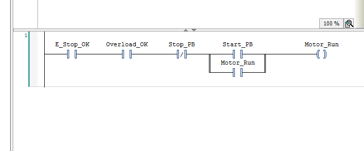
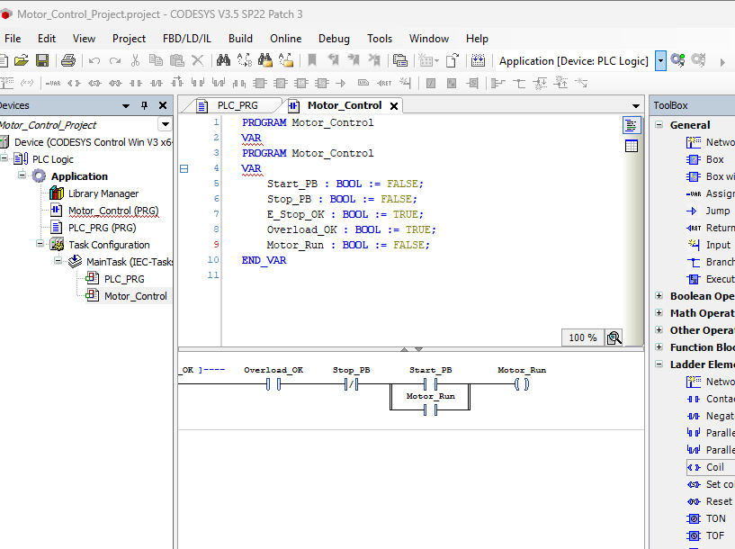
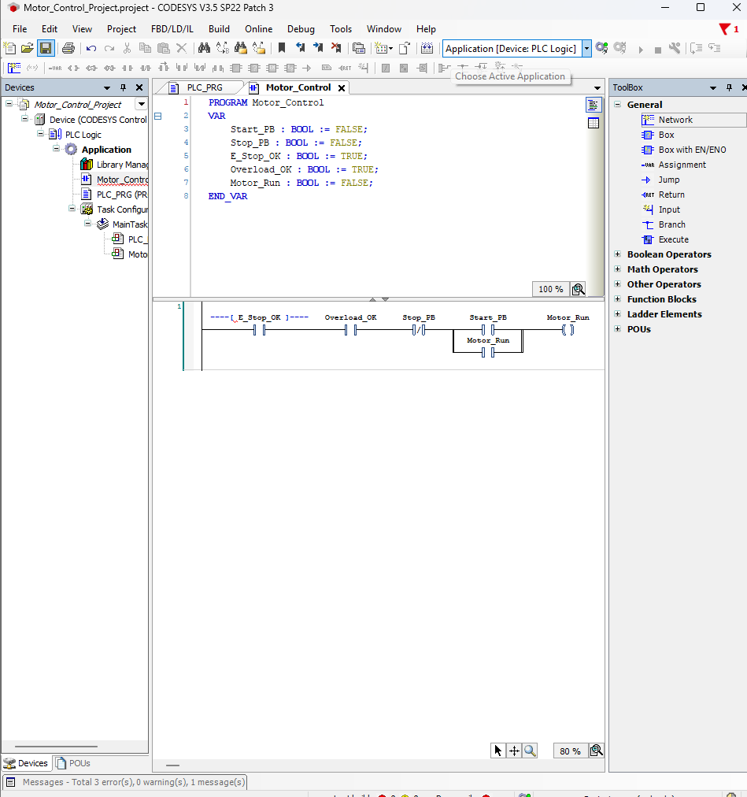
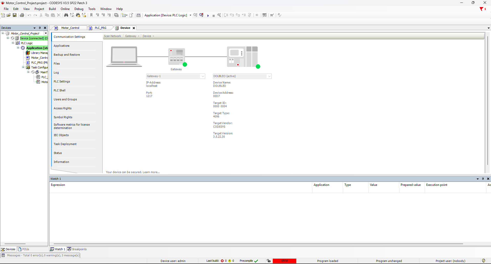
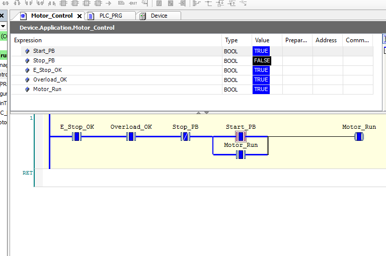
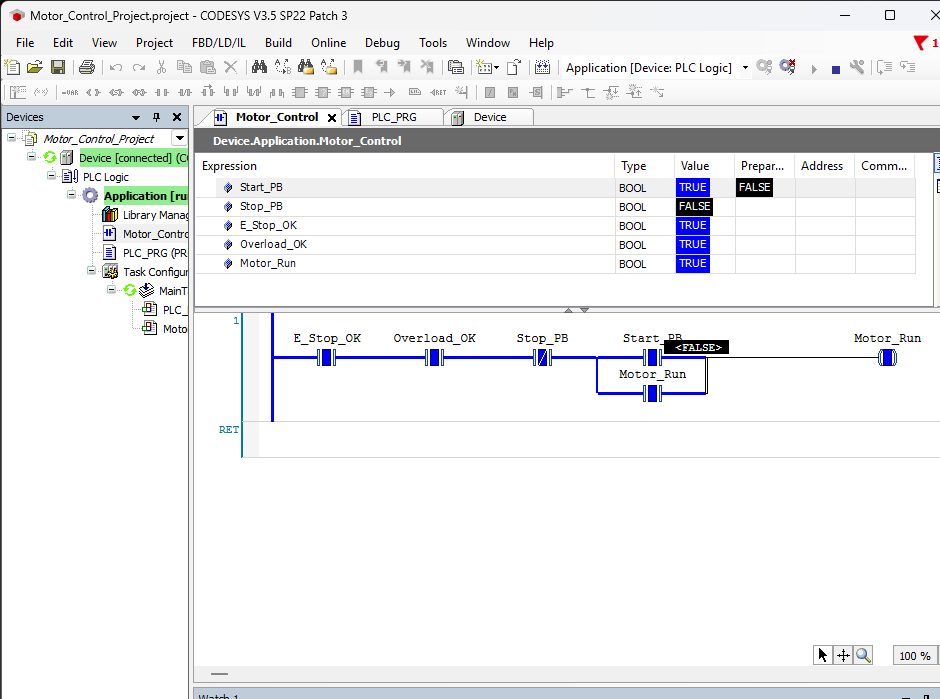
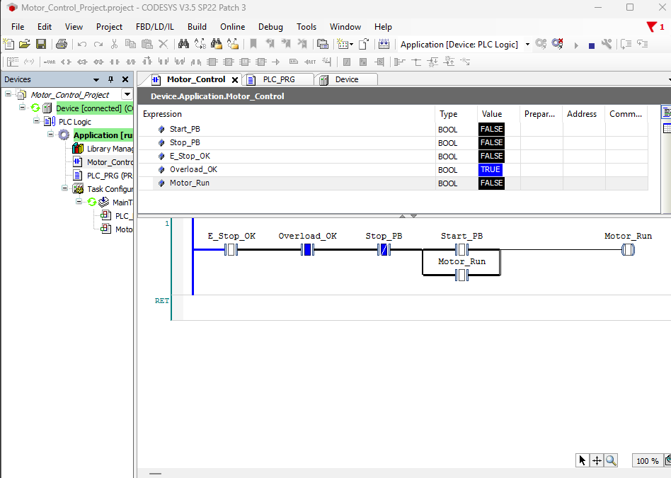
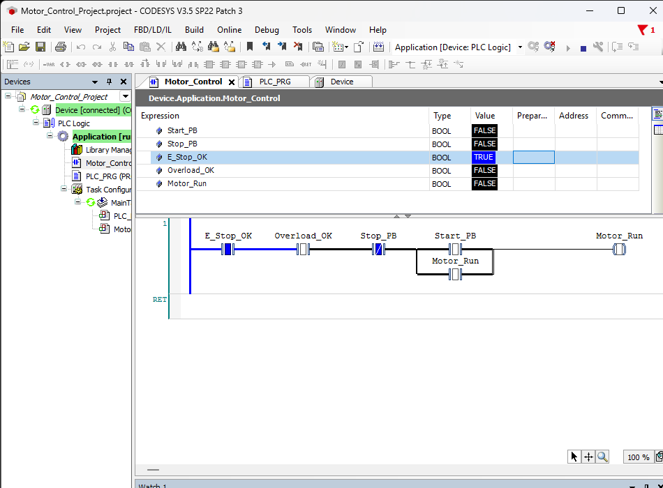

# PLC Motor Start/Stop Control — CODESYS Ladder Logic

## Project Overview
This project demonstrates a PLC-based motor start/stop control system built in **CODESYS V3.5 SP22** using **IEC 61131-3 Ladder Diagram (LD)**. The logic includes start/stop control, a motor seal-in circuit, simulated emergency-stop and overload permissives, task configuration, and live validation using **CODESYS Control Win V3 x64**.

> **Safety note:** `E_Stop_OK` and `Overload_OK` are simulated Boolean permissives for educational and runtime testing. A real emergency-stop function requires appropriate safety-rated hardware, circuits, and/or a safety controller.

## Key Features
- Start pushbutton control
- Stop pushbutton control
- Motor seal-in / holding circuit
- E-stop permissive logic
- Overload permissive logic
- Online variable monitoring
- Soft-PLC runtime testing
- Functional validation of start, latch, stop, E-stop, and overload behavior

## PLC Variables

| Variable | Type | Initial Value | Purpose |
|---|---|---:|---|
| `Start_PB` | BOOL | FALSE | Motor start command |
| `Stop_PB` | BOOL | FALSE | Motor stop command |
| `E_Stop_OK` | BOOL | TRUE | Simulated E-stop permissive |
| `Overload_OK` | BOOL | TRUE | Simulated overload permissive |
| `Motor_Run` | BOOL | FALSE | Motor run command/output |

## Ladder Logic

```text
 E_Stop_OK    Overload_OK     Stop_PB
----| |----------| |-----------|/|---------+----| | Start_PB ----+----( Motor_Run )
                                           |                    |
                                           +----| | Motor_Run ---+
```

Pressing `Start_PB` energizes `Motor_Run`. The parallel `Motor_Run` contact creates the seal-in path so the motor remains energized after Start is released. Pressing Stop, removing `E_Stop_OK`, or removing `Overload_OK` de-energizes the motor command.

## Functional Test Results

| Test | Expected Result | Result |
|---|---|---|
| Idle state | `Motor_Run = FALSE` | PASS |
| Start command | `Motor_Run = TRUE` | PASS |
| Release Start | `Motor_Run` stays TRUE | PASS |
| Stop command | `Motor_Run = FALSE` | PASS |
| E-stop permissive removed | `Motor_Run = FALSE` | PASS |
| Overload permissive removed | `Motor_Run = FALSE` | PASS |

Full results: [docs/test-results.md](docs/test-results.md)

## Screenshots

### 1. Complete Ladder Logic


### 2. Project / Task Configuration


### 3. Successful Build


### 4. PLC Runtime Connected


### 5. Motor Running Online


### 6. Seal-In / Latch Test


### 7. E-Stop Permissive Test


### 8. Overload Permissive Test


## Troubleshooting Performed
- Corrected Ladder contact operand syntax errors
- Built the parallel motor seal-in branch
- Assigned `Motor_Control` to `MainTask`
- Resolved Gateway vs. Control Win runtime connectivity
- Started and connected the CODESYS Control Win x64 soft PLC
- Established the active device path and device-user access
- Verified live variables and wrote test values online

## Skills Demonstrated
- PLC programming with Ladder Diagram
- Boolean control logic
- Motor starter seal-in circuits
- Permissive/interlock logic
- PLC task configuration
- Soft-PLC runtime setup
- Online monitoring and troubleshooting
- Functional verification and documentation

## CODESYS Project File
The original project file is included in this repository:

[`Motor_Control_Project.project`](Motor_Control_Project.project)

## Resume Project Entry
**PLC Motor Start/Stop Control — CODESYS**
- Developed and tested a PLC-based motor control application using IEC 61131-3 Ladder Logic in CODESYS.
- Implemented start/stop control, motor seal-in logic, simulated E-stop permissive, and overload permissive logic.
- Configured the application task and CODESYS Control Win x64 soft PLC for online simulation and testing.
- Validated start, seal-in, stop, E-stop permissive, and overload permissive behavior through live variable monitoring.

## Repository Structure

```text
PLC-Motor-Control-CODESYS/
├── README.md
├── Motor_Control_Project.project
├── 01-complete-ladder-logic.png
├── 02-task-configuration.png
├── 03-build-zero-errors.png
├── 04-plc-runtime-connected.png
├── 05-motor-running.png
├── 06-seal-in-latch.png
├── 07-estop-safety-test.png
├── 08-overload-safety-test.png
└── docs/
    └── test-results.md
```

## Author
**Onyekachi Onuoha**

Industrial Automation / Controls / Networking Portfolio
